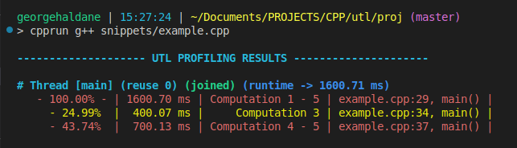
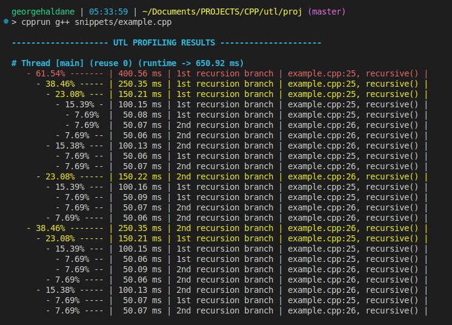
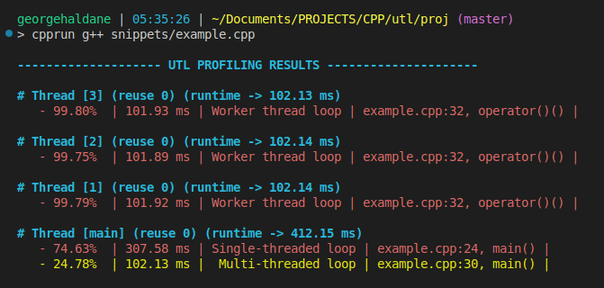
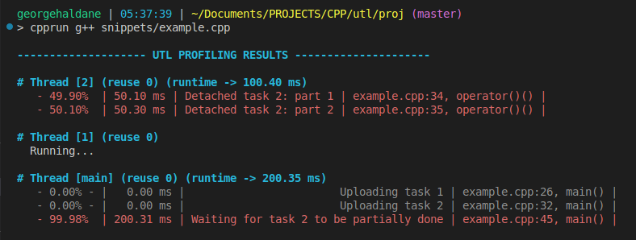

[](https://en.wikipedia.org/wiki/C%2B%2B#Standardization)
[](./LICENSE.md)
[](https://en.wikipedia.org/wiki/Header-only)
[](https://github.com/DmitriBogdanov/UTL/tree/master/single_include)

# utl::profiler

[<- to README.md](..)

[<- to implementation.hpp](https://github.com/DmitriBogdanov/UTL/blob/master/include/UTL/profiler.hpp)

**utl::profiler** is single-include solution for localized profiling, it features simple macros to measure how much time is taken by a certain scope / expression / code segment. Profiler automatically builds a call graph for all profiled functions and prints a nicely formatted table for every thread. See [examples](#examples).

Key features:

- Easy to use
- Low overhead
- No reliance on system APIs
- [Supports multi-threading](#profiling-parallel-section) & recursion
- Supports [CPU-counter timestamps](#reducing-overhead-with-x86-intrinsics)
- [Can export results at any point](#profiling-detached-threads-&-uploading-results) of the program
- Can be [fully disabled](#disabling-profiling)

Below is an output example from profiling a JSON parser:


## Definitions

```cpp
// Profiling macros
UTL_PROFILER_SCOPE(label);

UTL_PROFILER(label);

UTL_PROFILER_BEGIN(segment, label);
UTL_PROFILER_END(segment);

// Style options
struct Style {
    std::size_t indent = 2;
    bool        color  = true;

    double cutoff_red    = 0.40; // > 40% of total runtime
    double cutoff_yellow = 0.20; // > 20% of total runtime
    double cutoff_gray   = 0.01; // <  1% of total runtime
};

// Global profiler object
struct Profiler {
    void print_at_exit(bool value) noexcept;
    
    void upload_this_thread();
    
    std::string format_results(const Style& style = Style{});
};

inline Profiler profiler;
```

## Methods

### Profiling macros

> ```cpp
> UTL_PROFILER_SCOPE(label);
> ```

Attaches profiler to the current scope.

If profiled scope was entered at any point of the program, upon exiting `main()` a per-thread call graph will be built for all profiled segments.

**Note 1:** `label` is a **string literal** name that will be shown in the results table.

**Note 2:** Automatic printing on exit can be disabled.

> ```cpp
> UTL_PROFILER(label);
> ```

Attaches profiler to the scope of the following expression.

Convenient to profile individual loops / function calls / ifs and etc.

> ```cpp
> UTL_PROFILER_BEGIN(segment, label);
> UTL_PROFILER_END(segment);
> ```

Attaches profiler to the code section between two `BEGIN`/`END` macros with the same `segment` label.

### Style options

> ```cpp
> struct Style {
>     std::size_t indent = 2;
>     bool        color  = true;
> 
>     double cutoff_red    = 0.40; // > 40% of total runtime
>     double cutoff_yellow = 0.20; // > 20% of total runtime
>     double cutoff_gray   = 0.01; // <  1% of total runtime
> };
> ```

A struct with formatting settings for `Profiler::format_results()`.

### Global profiler object

> ```cpp
> void Profiler::print_at_exit(bool value) noexcept;
>    ```

Sets whether profiling results should be automatically printed after exiting from `main()`. `true` by default.

**Note:** This and all other profiler object methods are thread-safe.

> ```cpp
> void Profiler::upload_this_thread();
>    ```

Uploads profiling results from the current thread to the profiler object.

Can be used to upload results from detached threads. Otherwise results are automatically uploaded once detached thread joins another one. 

> ```cpp
> std::string Profiler::format_results(const Style& style = Style{});
>    ```

Formats profiling results to a string using given `style` options.

> ```cpp
> inline Profiler profiler;
> ```

Global profiler object.

## Examples

### Profiling code segment

> [!Note]
> Online compiler explorer may be a little weird when it comes to sleep & time measurement precision.

[ [Run this code](https://godbolt.org/#g:!((g:!((g:!((h:codeEditor,i:(filename:'1',fontScale:14,fontUsePx:'0',j:1,lang:c%2B%2B,selection:(endColumn:1,endLineNumber:2,positionColumn:1,positionLineNumber:2,selectionStartColumn:1,selectionStartLineNumber:2,startColumn:1,startLineNumber:2),source:'%23include+%3Chttps://raw.githubusercontent.com/DmitriBogdanov/UTL/master/single_include/UTL.hpp%3E%0A%0Ausing+namespace+std::chrono_literals%3B%0A%0Avoid+computation_1()+%7B+std::this_thread::sleep_for(300ms)%3B+%7D%0Avoid+computation_2()+%7B+std::this_thread::sleep_for(200ms)%3B+%7D%0Avoid+computation_3()+%7B+std::this_thread::sleep_for(400ms)%3B+%7D%0Avoid+computation_4()+%7B+std::this_thread::sleep_for(600ms)%3B+%7D%0Avoid+computation_5()+%7B+std::this_thread::sleep_for(100ms)%3B+%7D%0A%0Aint+main()+%7B%0A++++//+Profile+a+scope%0A++++UTL_PROFILER_SCOPE(%22Computation+1+-+5%22)%3B%0A++++computation_1()%3B%0A++++computation_2()%3B%0A%0A++++//+Profile+an+expression%0A++++UTL_PROFILER(%22Computation+3%22)+computation_3()%3B%0A%0A++++//+Profile+a+code+segment%0A++++UTL_PROFILER_BEGIN(comp_45,+%22Computation+4+-+5%22)%3B%0A++++computation_4()%3B%0A++++computation_5()%3B%0A++++UTL_PROFILER_END(comp_45)%3B%0A%7D%0A'),l:'5',n:'0',o:'C%2B%2B+source+%231',t:'0')),k:71.71783148269105,l:'4',n:'0',o:'',s:0,t:'0'),(g:!((g:!((h:compiler,i:(compiler:clang1600,filters:(b:'0',binary:'1',binaryObject:'1',commentOnly:'0',debugCalls:'1',demangle:'0',directives:'0',execute:'0',intel:'0',libraryCode:'0',trim:'1',verboseDemangling:'0'),flagsViewOpen:'1',fontScale:14,fontUsePx:'0',j:1,lang:c%2B%2B,libs:!(),options:'-std%3Dc%2B%2B17+-O2',overrides:!(),selection:(endColumn:1,endLineNumber:1,positionColumn:1,positionLineNumber:1,selectionStartColumn:1,selectionStartLineNumber:1,startColumn:1,startLineNumber:1),source:1),l:'5',n:'0',o:'+x86-64+clang+16.0.0+(Editor+%231)',t:'0')),header:(),l:'4',m:50,n:'0',o:'',s:0,t:'0'),(g:!((h:output,i:(compilerName:'x86-64+clang+16.0.0',editorid:1,fontScale:14,fontUsePx:'0',j:1,wrap:'1'),l:'5',n:'0',o:'Output+of+x86-64+clang+16.0.0+(Compiler+%231)',t:'0')),k:46.69421860597116,l:'4',m:50,n:'0',o:'',s:0,t:'0')),k:28.282168517308946,l:'3',n:'0',o:'',t:'0')),l:'2',n:'0',o:'',t:'0')),version:4) ]

```cpp
using namespace std::chrono_literals;

void computation_1() { std::this_thread::sleep_for(300ms); }
void computation_2() { std::this_thread::sleep_for(200ms); }
void computation_3() { std::this_thread::sleep_for(400ms); }
void computation_4() { std::this_thread::sleep_for(600ms); }
void computation_5() { std::this_thread::sleep_for(100ms); }

// ...

// Profile a scope
UTL_PROFILER_SCOPE("Computation 1 - 5");
computation_1();
computation_2();

// Profile an expression
UTL_PROFILER("Computation 3") computation_3();

// Profile a code segment
UTL_PROFILER_BEGIN(comp_45, "Computation 4 - 5");
computation_4();
computation_5();
UTL_PROFILER_END(comp_45);
```

Output:



### Profiling recursion

[ [Run this code](https://godbolt.org/#g:!((g:!((g:!((h:codeEditor,i:(filename:'1',fontScale:14,fontUsePx:'0',j:1,lang:c%2B%2B,selection:(endColumn:1,endLineNumber:12,positionColumn:1,positionLineNumber:12,selectionStartColumn:1,selectionStartLineNumber:12,startColumn:1,startLineNumber:12),source:'%23include+%3Chttps://raw.githubusercontent.com/DmitriBogdanov/UTL/master/single_include/UTL.hpp%3E%0A%0Avoid+recursive(int+depth+%3D+0)+%7B%0A++++if+(depth+%3E+4)+%7B%0A++++++++std::this_thread::sleep_for(std::chrono::milliseconds(50))%3B%0A++++++++return%3B%0A++++%7D%0A++++%0A++++UTL_PROFILER(%221st+recursion+branch%22)+recursive(depth+%2B+1)%3B%0A++++UTL_PROFILER(%222nd+recursion+branch%22)+recursive(depth+%2B+2)%3B%0A%7D%0A%0Aint+main()+%7B%0A++++recursive()%3B%0A%7D%0A'),l:'5',n:'0',o:'C%2B%2B+source+%231',t:'0')),k:71.71783148269105,l:'4',n:'0',o:'',s:0,t:'0'),(g:!((g:!((h:compiler,i:(compiler:clang1600,filters:(b:'0',binary:'1',binaryObject:'1',commentOnly:'0',debugCalls:'1',demangle:'0',directives:'0',execute:'0',intel:'0',libraryCode:'0',trim:'1',verboseDemangling:'0'),flagsViewOpen:'1',fontScale:14,fontUsePx:'0',j:1,lang:c%2B%2B,libs:!(),options:'-std%3Dc%2B%2B17+-O2',overrides:!(),selection:(endColumn:1,endLineNumber:1,positionColumn:1,positionLineNumber:1,selectionStartColumn:1,selectionStartLineNumber:1,startColumn:1,startLineNumber:1),source:1),l:'5',n:'0',o:'+x86-64+clang+16.0.0+(Editor+%231)',t:'0')),header:(),l:'4',m:50,n:'0',o:'',s:0,t:'0'),(g:!((h:output,i:(compilerName:'x86-64+clang+16.0.0',editorid:1,fontScale:14,fontUsePx:'0',j:1,wrap:'1'),l:'5',n:'0',o:'Output+of+x86-64+clang+16.0.0+(Compiler+%231)',t:'0')),k:46.69421860597116,l:'4',m:50,n:'0',o:'',s:0,t:'0')),k:28.282168517308946,l:'3',n:'0',o:'',t:'0')),l:'2',n:'0',o:'',t:'0')),version:4) ]

```cpp
void recursive(int depth = 0) {
    if (depth > 4) {
        std::this_thread::sleep_for(std::chrono::milliseconds(50));
        return;
    }
    
    UTL_PROFILER("1st recursion branch") recursive(depth + 1);
    UTL_PROFILER("2nd recursion branch") recursive(depth + 2);
}

// ...

recursive();
```

Output:



### Profiling parallel section

> [!Note]
> In this example we will use [utl::parallel](https://github.com/DmitriBogdanov/UTL/blob/master/docs/module_parallel.md) to represent a parallel section concisely.

[ [Run this code](https://godbolt.org/#g:!((g:!((g:!((h:codeEditor,i:(filename:'1',fontScale:14,fontUsePx:'0',j:1,lang:c%2B%2B,selection:(endColumn:1,endLineNumber:5,positionColumn:1,positionLineNumber:5,selectionStartColumn:1,selectionStartLineNumber:5,startColumn:1,startLineNumber:5),source:'%23include+%3Chttps://raw.githubusercontent.com/DmitriBogdanov/UTL/master/single_include/UTL.hpp%3E%0A%0Ausing+namespace+utl%3B%0Ausing+namespace+std::chrono_literals%3B%0A%0Aint+main()+%7B%0A++++//+Run+loop+on+the+main+thread%0A++++UTL_PROFILER(%22Single-threaded+loop%22)%0A++++for+(int+i+%3D+0%3B+i+%3C+30%3B+%2B%2Bi)+std::this_thread::sleep_for(10ms)%3B%0A%0A++++//+Run+the+same+loop+on+3+threads%0A++++parallel::set_thread_count(3)%3B%0A%0A++++UTL_PROFILER(%22Multi-threaded+loop%22)%0A++++parallel::for_loop(parallel::IndexRange%7B0,+30%7D,+%5B%5D(int+low,+int+high)%7B%0A++++++++UTL_PROFILER(%22Worker+thread+loop%22)%0A++++++++for+(int+i+%3D+low%3B+i+%3C+high%3B+%2B%2Bi)+std::this_thread::sleep_for(10ms)%3B%0A++++%7D)%3B%0A%0A++++parallel::set_thread_count(0)%3B%0A%7D%0A'),l:'5',n:'0',o:'C%2B%2B+source+%231',t:'0')),k:71.71783148269105,l:'4',n:'0',o:'',s:0,t:'0'),(g:!((g:!((h:compiler,i:(compiler:clang1600,filters:(b:'0',binary:'1',binaryObject:'1',commentOnly:'0',debugCalls:'1',demangle:'0',directives:'0',execute:'0',intel:'0',libraryCode:'0',trim:'1',verboseDemangling:'0'),flagsViewOpen:'1',fontScale:14,fontUsePx:'0',j:1,lang:c%2B%2B,libs:!(),options:'-std%3Dc%2B%2B17+-O2',overrides:!(),selection:(endColumn:1,endLineNumber:1,positionColumn:1,positionLineNumber:1,selectionStartColumn:1,selectionStartLineNumber:1,startColumn:1,startLineNumber:1),source:1),l:'5',n:'0',o:'+x86-64+clang+16.0.0+(Editor+%231)',t:'0')),header:(),l:'4',m:50,n:'0',o:'',s:0,t:'0'),(g:!((h:output,i:(compilerName:'x86-64+clang+16.0.0',editorid:1,fontScale:14,fontUsePx:'0',j:1,wrap:'1'),l:'5',n:'0',o:'Output+of+x86-64+clang+16.0.0+(Compiler+%231)',t:'0')),k:46.69421860597116,l:'4',m:50,n:'0',o:'',s:0,t:'0')),k:28.282168517308946,l:'3',n:'0',o:'',t:'0')),l:'2',n:'0',o:'',t:'0')),version:4) ]

```cpp
using namespace utl;
using namespace std::chrono_literals;

// Run loop on the main thread
UTL_PROFILER("Single-threaded loop")
for (int i = 0; i < 30; ++i) std::this_thread::sleep_for(10ms);

// Run the same loop on 3 threads
parallel::set_thread_count(3);

UTL_PROFILER("Multi-threaded loop")
parallel::for_loop(parallel::IndexRange{0, 30}, [](int low, int high){
    UTL_PROFILER("Worker thread loop")
    for (int i = low; i < high; ++i) std::this_thread::sleep_for(10ms);
});

parallel::set_thread_count(0);
```

Output:



### Profiling detached threads & uploading results

> [!Note]
> In this example we will use [utl::parallel](https://github.com/DmitriBogdanov/UTL/blob/master/docs/module_parallel.md) to represent detached section concisely.

[ [Run this code](https://godbolt.org/#g:!((g:!((g:!((h:codeEditor,i:(filename:'1',fontScale:14,fontUsePx:'0',j:1,lang:c%2B%2B,selection:(endColumn:13,endLineNumber:6,positionColumn:13,positionLineNumber:6,selectionStartColumn:13,selectionStartLineNumber:6,startColumn:13,startLineNumber:6),source:'%23include+%3Chttps://raw.githubusercontent.com/DmitriBogdanov/UTL/master/single_include/UTL.hpp%3E%0A%0Ausing+namespace+utl%3B%0Ausing+namespace+std::chrono_literals%3B%0A%0Aint+main()+%7B%0A++++parallel::set_thread_count(2)%3B%0A%0A++++//+Detached+task%0A++++UTL_PROFILER(%22Uploading+task+1%22)%0A++++parallel::task(%5B%5D%7B%0A++++++++UTL_PROFILER(%22Detached+task+1:+part+1%22)+std::this_thread::sleep_for(700ms)%3B%0A++++%7D)%3B%0A%0A++++//+Detached+task+with+explicit+result+upload%0A++++UTL_PROFILER(%22Uploading+task+2%22)%0A++++parallel::task(%5B%5D%7B%0A++++++++UTL_PROFILER(%22Detached+task+2:+part+1%22)+std::this_thread::sleep_for(50ms)%3B%0A++++++++UTL_PROFILER(%22Detached+task+2:+part+2%22)+std::this_thread::sleep_for(50ms)%3B%0A%0A++++++++//+Manually+upload+results+to+the+main+thread,%0A++++++++//+otherwise+results+get+collected+once+the+thread+joins%0A++++++++profiler::profiler.upload_this_thread()%3B%0A%0A++++++++UTL_PROFILER(%22Detached+task+2:+part+3%22)+std::this_thread::sleep_for(500ms)%3B%0A++++%7D)%3B%0A%0A++++//+Wait+a+little+so+the+2nd+task+has+time+to+reach+manual+upload%0A++++UTL_PROFILER(%22Waiting+for+task+2+to+be+partially+done%22)%0A++++std::this_thread::sleep_for(200ms)%3B%0A%0A++++//+Format+results+explicitly%0A++++profiler::profiler.print_at_exit(false)%3B%0A%0A++++std::cout+%3C%3C+profiler::profiler.format_results()%3B%0A%7D%0A'),l:'5',n:'0',o:'C%2B%2B+source+%231',t:'0')),k:71.71783148269105,l:'4',n:'0',o:'',s:0,t:'0'),(g:!((g:!((h:compiler,i:(compiler:clang1600,filters:(b:'0',binary:'1',binaryObject:'1',commentOnly:'0',debugCalls:'1',demangle:'0',directives:'0',execute:'0',intel:'0',libraryCode:'0',trim:'1',verboseDemangling:'0'),flagsViewOpen:'1',fontScale:14,fontUsePx:'0',j:1,lang:c%2B%2B,libs:!(),options:'-std%3Dc%2B%2B17+-O2',overrides:!(),selection:(endColumn:1,endLineNumber:1,positionColumn:1,positionLineNumber:1,selectionStartColumn:1,selectionStartLineNumber:1,startColumn:1,startLineNumber:1),source:1),l:'5',n:'0',o:'+x86-64+clang+16.0.0+(Editor+%231)',t:'0')),header:(),l:'4',m:50,n:'0',o:'',s:0,t:'0'),(g:!((h:output,i:(compilerName:'x86-64+clang+16.0.0',editorid:1,fontScale:14,fontUsePx:'0',j:1,wrap:'1'),l:'5',n:'0',o:'Output+of+x86-64+clang+16.0.0+(Compiler+%231)',t:'0')),k:46.69421860597116,l:'4',m:50,n:'0',o:'',s:0,t:'0')),k:28.282168517308946,l:'3',n:'0',o:'',t:'0')),l:'2',n:'0',o:'',t:'0')),version:4) ]

```cpp
using namespace utl;
using namespace std::chrono_literals;

parallel::set_thread_count(2);

// Detached task
UTL_PROFILER("Uploading task 1")
parallel::task([]{
    UTL_PROFILER("Detached task 1: part 1") std::this_thread::sleep_for(700ms);
});

// Detached task with explicit result upload
UTL_PROFILER("Uploading task 2")
parallel::task([]{
    UTL_PROFILER("Detached task 2: part 1") std::this_thread::sleep_for(50ms);
    UTL_PROFILER("Detached task 2: part 2") std::this_thread::sleep_for(50ms);

    // Manually upload results to the main thread,
    // otherwise results get collected once the thread joins
    profiler::profiler.upload_this_thread();

    UTL_PROFILER("Detached task 2: part 3") std::this_thread::sleep_for(500ms);
});

// Wait a little so the 2nd task has time to reach manual upload
UTL_PROFILER("Waiting for task 2 to be partially done")
std::this_thread::sleep_for(200ms);

// Format results explicitly
profiler::profiler.print_at_exit(false);

std::cout << profiler::profiler.format_results();
```

Output:



### Custom style & exporting results to a file

[ [Run this code](https://godbolt.org/#g:!((g:!((g:!((h:codeEditor,i:(filename:'1',fontScale:14,fontUsePx:'0',j:1,lang:c%2B%2B,selection:(endColumn:1,endLineNumber:5,positionColumn:1,positionLineNumber:5,selectionStartColumn:1,selectionStartLineNumber:5,startColumn:1,startLineNumber:5),source:'%23include+%3Chttps://raw.githubusercontent.com/DmitriBogdanov/UTL/master/single_include/UTL.hpp%3E%0A%0Ausing+namespace+utl%3B%0Ausing+namespace+std::chrono_literals%3B%0A%0Aint+main()+%7B%0A++++//+Profile+something%0A++++UTL_PROFILER(%22Loop%22)%0A++++for+(int+i+%3D+0%3B+i+%3C+10%3B+%2B%2Bi)+%7B%0A++++++++UTL_PROFILER(%221st+half+of+the+loop%22)+std::this_thread::sleep_for(10ms)%3B%0A++++++++UTL_PROFILER(%222nd+half+of+the+loop%22)+std::this_thread::sleep_for(10ms)%3B%0A++++%7D%0A%0A++++//+Disable+automatic+printing%0A++++profiler::profiler.print_at_exit(false)%3B%0A%0A++++//+Disable+colors,+remove+indent,+format+to+string%0A++++profiler::Style+style%3B%0A++++style.color++%3D+false%3B%0A++++style.indent+%3D+0%3B%0A%0A++++const+std::string+results+%3D+profiler::profiler.format_results(style)%3B%0A%0A++++//+Export+to+file+%26+console%0A++++std::ofstream(%22profiling_results.txt%22)+%3C%3C+results%3B%0A++++std::cout++++++++++++++++++++++++++++++%3C%3C+results%3B%0A%7D%0A'),l:'5',n:'0',o:'C%2B%2B+source+%231',t:'0')),k:71.71783148269105,l:'4',n:'0',o:'',s:0,t:'0'),(g:!((g:!((h:compiler,i:(compiler:clang1600,filters:(b:'0',binary:'1',binaryObject:'1',commentOnly:'0',debugCalls:'1',demangle:'0',directives:'0',execute:'0',intel:'0',libraryCode:'0',trim:'1',verboseDemangling:'0'),flagsViewOpen:'1',fontScale:14,fontUsePx:'0',j:1,lang:c%2B%2B,libs:!(),options:'-std%3Dc%2B%2B17+-O2',overrides:!(),selection:(endColumn:1,endLineNumber:1,positionColumn:1,positionLineNumber:1,selectionStartColumn:1,selectionStartLineNumber:1,startColumn:1,startLineNumber:1),source:1),l:'5',n:'0',o:'+x86-64+clang+16.0.0+(Editor+%231)',t:'0')),header:(),l:'4',m:50,n:'0',o:'',s:0,t:'0'),(g:!((h:output,i:(compilerName:'x86-64+clang+16.0.0',editorid:1,fontScale:14,fontUsePx:'0',j:1,wrap:'1'),l:'5',n:'0',o:'Output+of+x86-64+clang+16.0.0+(Compiler+%231)',t:'0')),k:46.69421860597116,l:'4',m:50,n:'0',o:'',s:0,t:'0')),k:28.282168517308946,l:'3',n:'0',o:'',t:'0')),l:'2',n:'0',o:'',t:'0')),version:4) ]

```cpp
using namespace utl;
using namespace std::chrono_literals;

// Profile something
UTL_PROFILER("Loop")
for (int i = 0; i < 10; ++i) {
    UTL_PROFILER("1st half of the loop") std::this_thread::sleep_for(10ms);
    UTL_PROFILER("2nd half of the loop") std::this_thread::sleep_for(10ms);
}

// Disable automatic printing
profiler::profiler.print_at_exit(false);

// Disable colors, remove indent, format to string
profiler::Style style;
style.color  = false;
style.indent = 0;

const std::string results = profiler::profiler.format_results(style);

// Export to file & console
std::ofstream("profiling_results.txt") << results;
std::cout                              << results;
```

Output:

```
-------------------- UTL PROFILING RESULTS ---------------------

# Thread [main] (reuse 0) (running) (runtime -> 201.81 ms)
 - 99.99%  | 201.79 ms |                 Loop | example.cpp:8, main()  |
 - 49.91%  | 100.73 ms | 1st half of the loop | example.cpp:10, main() |
 - 50.07%  | 101.04 ms | 2nd half of the loop | example.cpp:11, main() |
```

## Reducing overhead with x86 intrinsics

By far the most significant part of profiling overhead comes from calls to `std::chrono::steady_clock::now()`.

It is possible to significantly reduce that overhead by using CPU-counter intrinsics. To do so simply define `UTL_PROFILER_USE_INTRINSICS_FOR_FREQUENCY` macro with a need frequency:

```cpp
#define UTL_PROFILER_USE_INTRINSICS_FOR_FREQUENCY 3.3e9 // 3.3 GHz (AMD Ryzen 5 5600H)
#include "UTL/profiler.hpp"                             // will now use 'rdtsc' for timestamps
```

This is exceedingly helpful when profiling code on a hot path. Below are a few [benchmarks](https://github.com/DmitriBogdanov/UTL/tree/master/benchmarks/benchmark_profiler.cpp) showcasing the difference on particular hardware:

```
======= USING std::chrono ========

| relative |               ms/op |                op/s |    err% |     total | benchmark
|---------:|--------------------:|--------------------:|--------:|----------:|:----------
|   100.0% |                3.46 |              289.22 |    0.1% |      0.44 | `Runtime without profiling`
|    53.9% |                6.41 |              155.90 |    0.3% |      0.77 | `Theoretical best std::chrono profiler`
|    52.2% |                6.62 |              151.07 |    0.2% |      0.80 | `UTL_PROFILER()`

// very light workload - just 8 computations of 'std::cos()' per 2 time measurements, difficult to
// time and sensitive to overhead, here profiled code is ~2x slower then the non-profiled workload

====== USING __rdtsc() ======

| relative |               ms/op |                op/s |    err% |     total | benchmark
|---------:|--------------------:|--------------------:|--------:|----------:|:----------
|   100.0% |                3.50 |              286.11 |    0.6% |      0.43 | `Runtime without profiling`
|    86.3% |                4.05 |              247.01 |    0.2% |      0.49 | `Theoretical best __rdtsc() profiler`
|    73.7% |                4.74 |              210.97 |    0.3% |      0.57 | `UTL_PROFILER()`

// notable reduction in profiling overhead
```

> [!Note]
> Here *"theoretical best"* refers to a hypothetical profiler that requires zero operations aside from measuring the time at two points  — before and after entering the code segment.

## Disabling profiling

To disable any profiling code from interfering with the program, simply define `UTL_PROFILER_DISABLE` before including the header:

```cpp
#define UTL_PROFILER_DISABLE
#include "UTL/profiler.hpp"
// - the header is now stripped of any and all code and only provides no-op mocks of the public API,
//   this means effectively no impact on compile times
// - 'profiler.format_results()' now returns "<profiling is disabled>"
```


## Behind the scenes

A simple & naive way to construct a call graph would be through building a tree of nodes using `std::unordered_map<std::string, Node>` with call-site as a key. Such approach however makes the overhead of tree expansion & traversal incredibly high, rendering profiler useless for small tasks.

### Call graph traversal

This library uses a bunch of `thread_local` variables (created by macros) to correlate call-sites with integer IDs and reduces tree traversal logic to traversing a "network" of indices encoded as a dense $M \times N$ matrix where $M$ — number of call-sites visited by this thread, $N$ — number of nodes in the call graph.

There are some additional details & arrays, but the bottom-line is that by associating everything we can with linearly growing IDs and delaying "heavy" things as much as possible until thread destruction / formatting, we can reduce almost all common operations outside of time measurement to trivial integer array lookups.

This way, the cost of re-entry on existing call graph nodes (aka the fast path taken most of the time) is reduced down to a single array lookup & branch that gets predicted most of the time.

New call-site entry & new node creation are rare slow paths, they only happen during call-graph expansion and will have very little contribution to the runtime outside of measuring very deep recursion. By using an `std::vector`-like allocation strategy for both rows & columns it is possible to make reallocation amortized $O(1)$.

### Memory usage

Memory overhead of profiling is mostly defined by the aforementioned call graph matrix. For example, on thread that runs into `20` profiling macros and creates `100` nodes, memory overhead is going to be `8 kB`. A thread that runs into `100` profiling macros and creates `500` call graph nodes, memory overhead will be `0.2 MB`.

It is possible to further reduce memory overhead (down to `4 kB` and `0.1 MB`) by defining a `UTL_PROFILER_USE_SMALL_IDS` macro before the include:

```cpp
#define UTL_PROFILER_USE_SMALL_IDS
#include "UTL/profiler.hpp"
```

This switches implementation to 16-bit IDs, which limits the max number of nodes to `65535`. For most practical purposes this should be more than enough as most machines will reach stack overflow far before reaching such depth of the call graph.

### Thread safety

Almost all profiling is lock-free, there are only 3 points at which implementation needs to lock a mutex:

- When creating a new thread
- When joining a thread
- When manually calling `profiler.upload_this_thread()`

All public API is thread-safe.